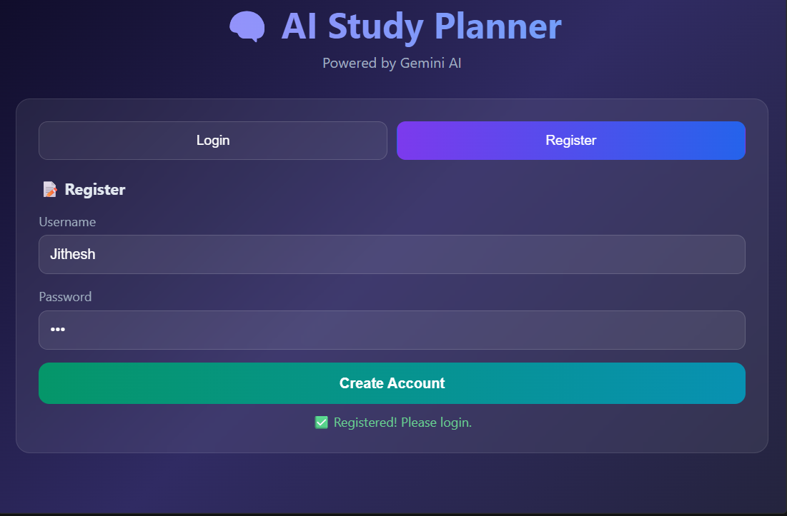
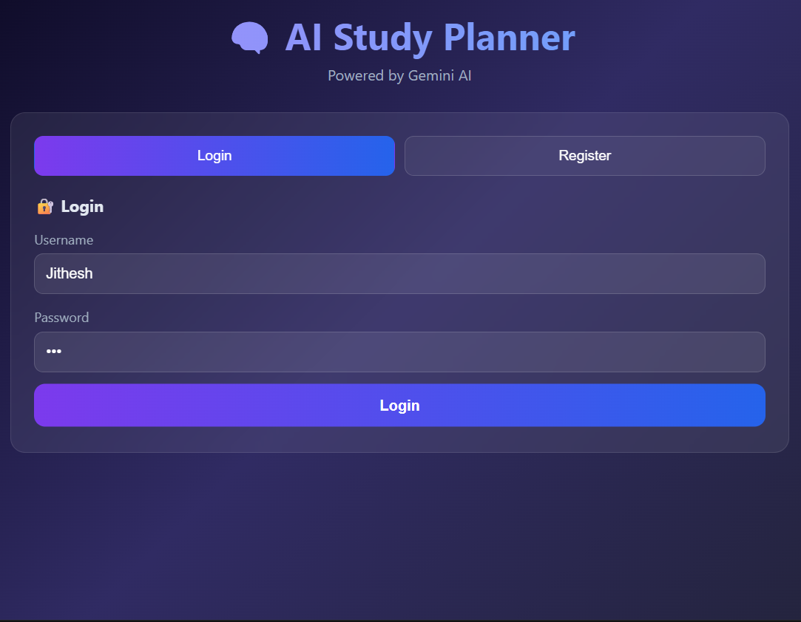
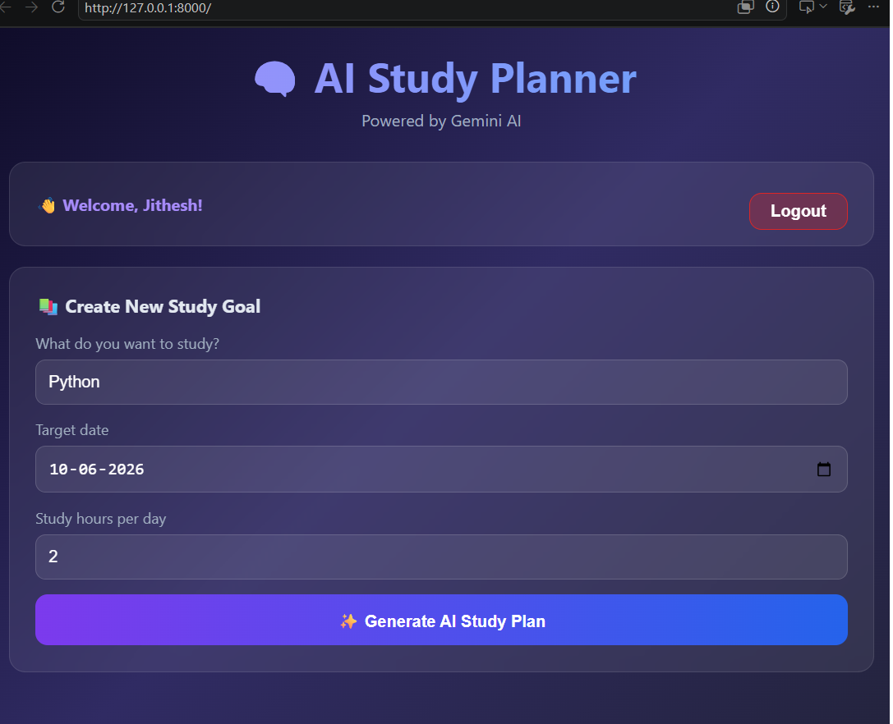
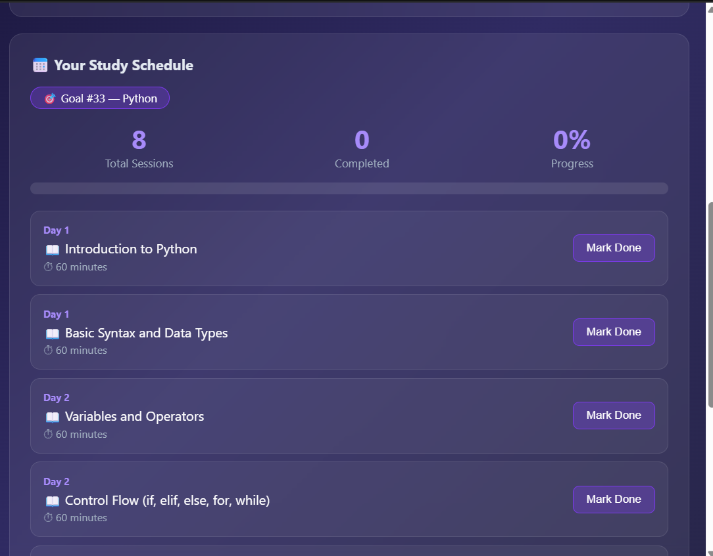
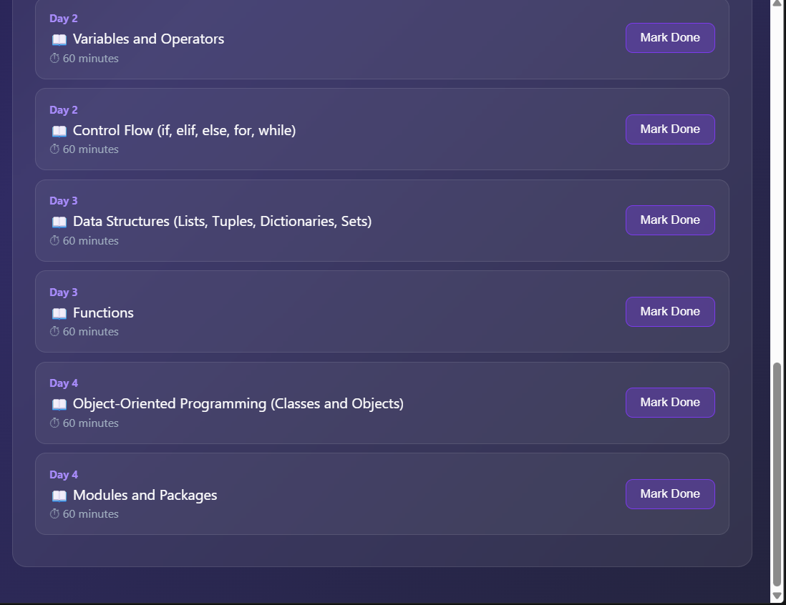
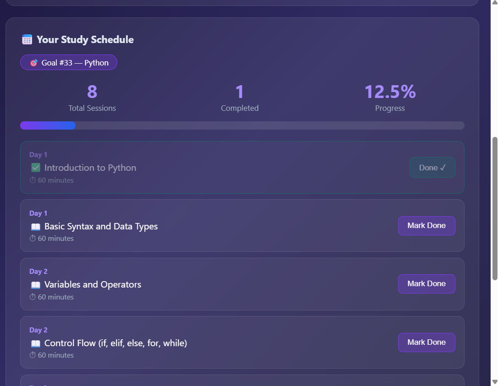

# AI Study Planner

AI-powered study planner built with FastAPI, SQLAlchemy ORM,SQLite,Gemini AI, HTML, CSS, and JavaScript.

## Features

- User registration and login
- Secure password authentication
- AI-generated study plans
- Progress tracking
- Session completion tracking
- Lightweight database integration using SQLite

## Tech Stack

- FastAPI
- SQLite
- SQLAlchemy ORM
- Gemini AI
- HTML/CSS/JavaScript
- Passlib & bcrypt

## Screenshots

### Register

### Login

### Create Goal

### Study Schedule

### Schedule Page 2

### Progress Tracking

